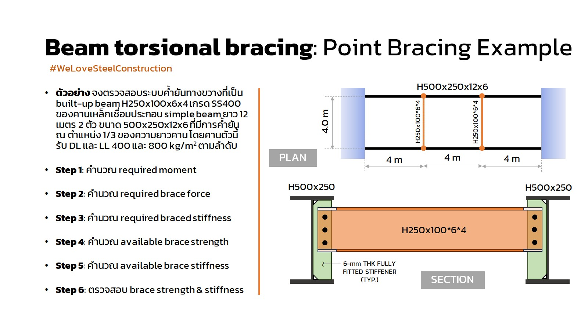

# POINT TORSIONAL STABILITY BRACING OF A BEAM.

### Load

Dead Load: $DL=800\frac{kg}{m^2}$

$DL_{line}=1600\frac{kg}{m}$

Live Load: $LL=400\frac{kg}{m^2}$

$LL_{line}=800\frac{kg}{m}$

$W_{factor}=1.2*(1600)+1.6*(800)=3200\frac{kg}{m}$

### Material Property

Yield Strength: $f_y=245MPa$ 

### Section Property of H-250x100x6x4

Section Area: $A_s=21.52cm^2$

Moment of inertia about y: $I_x=2235cm^4$

### Section Property of H-500x250x12x6

Section Area: $A_s=88.56cm^2$

Moment of inertia about y: $I_y=3126 cm^4$

## 1. Required Moment.

| ASD | LRFD |
| ------ | ------ |
| $M=\frac{W_u*l^2}{8}=\frac{2400*12^2}{8}$ | $M=\frac{W_u*l^2}{8}=\frac{3200*12^2}{8}$ |
| $M_r=43200kg.m$ | $M_r=57600kg.m$ |

## 2. Required Brace Force (The required flexural strength for a point torsional brace).

| ASD | LRFD |
| ------ | ------ |
| $M_{br}=0.02M_a$ | $M_{br}=0.02M_u$ |
| $M_{br}=864kg.m$ | $M_{br}=1152kg.m$ |

## 3. Required Braced Stiffness.

| ASD | LRFD |
| ------ | ------ |
| $\beta_{T}=\Omega\frac{2.4*L}{nEI_{yeff}}(\frac{M_r}{C_b})^2$ | $\beta_{T}=\frac{1}{\phi}\frac{2.4*L}{nEI_{yeff}}(\frac{M_r}{C_b})^2$ |
| $\beta_{T}=3*\frac{2.4*12*10^3}{3*2*10^6*3126*10^4}(\frac{864*10^{3}*9.81}{1})^2$ | $\beta_{T}=\frac{1}{0.75}*\frac{2.4*12*10^3}{3*2*10^6*3126*10^4}(\frac{1152*10^{3}*9.81}{1})^2$ |
| $\beta_{T}=33093\frac{N}{rad.}$ | $\beta_{T}=26148\frac{N}{rad.}$ |

## 4. Avilable Braced Strength.

From:

$M_n=M_p=F_yZ\le 1.6*F_yS_x$

$Z=203.04cm^3$

$S_x=178.87cm^3$

$1.6*F_yS_x = 1.6*245*178.87*10^3 = 70.12*10^6kN.m$

$M_n=F_yZ=245*203.04*10^3 = 49.74*10^6kN.m \le 70.12*10^6kN.m$ is true;

$M_n= 49.74*10^6kN.m$

## 5. Avilable Braced Stiffness and Design thinkness of stiffeners.

$\beta_{Tb}=\frac{6EI}{L}=\frac{6*2*10^6*2256*10^4}{4*10^3}\frac{N}{rad.}$

$\beta_{Tb}=6.77*10^{10}\frac{N}{rad.}$

From:

$\frac{1}{\beta_T}=\frac{1}{\beta_{TB}}+\frac{1}{\beta_{sec}}$

| ASD | LRFD |
| ------ | ------ |
| $\frac{1}{33093}=\frac{1}{6.77*10^{10}}+\frac{1}{\beta_{sec}}$ | $\frac{1}{26148}=\frac{1}{6.77*10^{10}}+\frac{1}{\beta_{sec}}$ |
| $\beta_{sec}=33093\frac{N}{rad.}$ | $\beta_{sec}=26148\frac{N}{rad.}$ |

Determine the required width, bs, of 6 mm.-thick of stiffeners.

From:

$\beta_{sec}=\frac{3.3*E}{h_o}*[\frac{1.5*h_o*t_w^3}{12}+\frac{t_{st}*b_s^3}{12}]$

| ASD | LRFD |
| ------ | ------ |
| $33093=\frac{3.3*2*10^6}{488}*[\frac{1.5*488*6^3}{12}+\frac{6*b_s^3}{12}]$ | $26148=\frac{3.3*2*10^6}{488}*[\frac{1.5*488*6^3}{12}+\frac{6*b_s^3}{12}]$ |
| $b_s=-29mm. < 0 (ok)$ | $b_s=-29mm. < 0 (ok)$ |

Stiffness Check OK.

## 6. Brace Strength Check.

| ASD | LRFD |
| ------ | ------ |
| $\frac{M_n}{\Omega}=\frac{49.74*10^6}{3}=16.58*10^6kN.m$ | $\phi M=0.75*49.74*10^6=37.31*10^6kN.m$ |
| 16.58*10^6kN.m > 8.64kN.m (ok) | 37.31*10^6kN.m > 11.52kN.m (ok) |